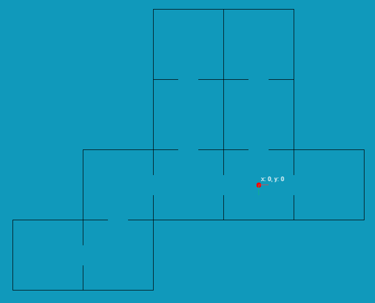

<p align="center">
    
</p>

# Random Box Room

Create a map made up of a number of connected box rooms, and then control that little red dot to move inside.

This project is mainly used to validate some ideas, and it may not have any practical significance.

## How to run

```bash
# recommend using pnpm
pnpm install
pnpm dev
```

## License

MIT License © 2024 [Archer Gu](https://github.com/archergu)
